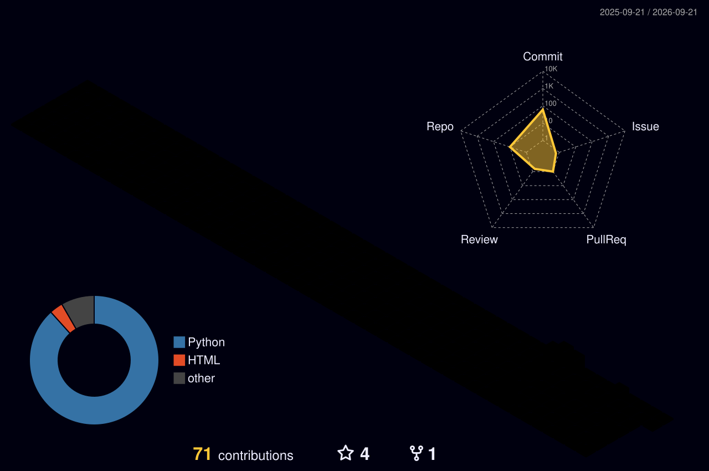

# 💫 About Me:
🔭 I’m currently working on building strong foundations in **Data Structures & Algorithms** and real-world **AI projects** 
👯 I’m looking to collaborate on **open-source projects** related to AI, backend systems, or developer tools 
🌱 I’m currently learning **Artificial Intelligence, Machine Learning, Data Science, and Backend Development** 
💬 Ask me about **C++, DSA, beginner-friendly AI concepts, and project building** 
🎓 B.Tech in Artificial Intelligence & Data Science @ CIT

## 🌐 Socials:
 

# 💻 Tech Stack:
          

# 📊 GitHub Stats:
 
 

### ✍️ Random Dev Quote

### 🔝 Top Contributed Repo

<picture>
  <source media="(prefers-color-scheme: dark)" srcset="https://raw.githubusercontent.com/kumaranpy/kumaranpy/output/github-snake-dark.svg" />
  <source media="(prefers-color-scheme: light)" srcset="https://raw.githubusercontent.com/kumaranpy/kumaranpy/output/github-snake.svg" />
  
</picture>

## <picture>  </picture> My Competitive Programming Profiles

  
  
  

